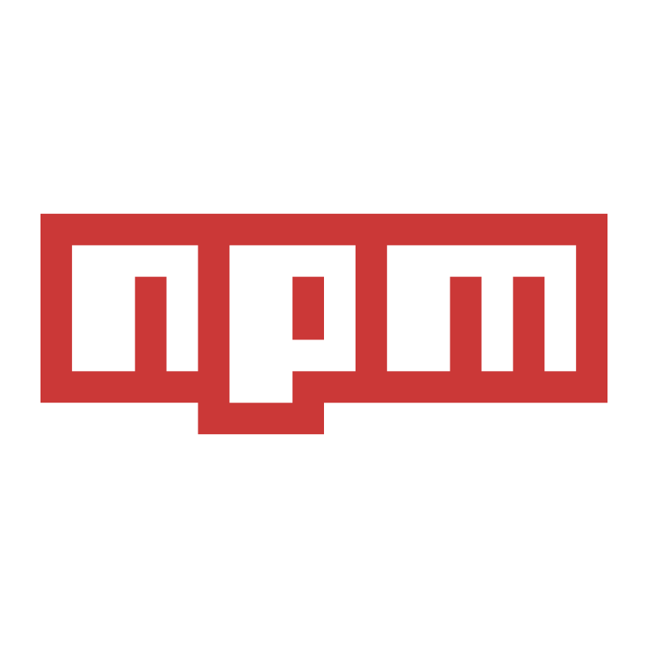

  <h1>
    Hey there, I'm Maks! 
    
  </h1>
  
Welcome to my GitHub profile! ✨

### About Me :

<code>🎓 Student: KPI </code>
<code>⚪ Community: Metarhia</code>
<code>👷 Speciality: Software Engineer / Frontend Developer</code> 
<code>💡 [Skills](SKILLS.md)</code>
<code>🧻 [Projects](PROJECTS.md)</code>
<code>📢 [Public talks: 0](TALKS.md)</code>
<code>👀 [Reports](REPORTS.md)</code>
<code>🪙 [myCertificates](https://github.com/makskhv21/myCertificates)</code>
<code>📚 [Rates](RATES.md)</code> 
<code>💬 LinkedIn: [Maksim Khvyts](https://www.linkedin.com/in/maksim-khvyts-5833b82b5/)</code>
<code>📫 [Email](mailto:m.khvyts.ser@gmail.com)</code>

---

### My stack and tools :

  <table align="center">
    <tr>
      <td align="center"  width="88">
        
         HTML5
      </td>
      <td align="center" width="88">
        
         CSS3
      </td>
      <td align="center" width="88">
        
         JavaScript
      </td>
      <td align="center" width="88">
        
         TypeScript
      </td>
      <td align="center" width="88">
        
         Python
      </td>
      <td align="center" width="88">
        
         React.js
      </td>
      <td align="center" width="88">
        
         Node.js
      </td>
      <td align="center" width="88">
        
         SQL
      </td>
      <td align="center" width="88">
        
         Sass
      </td>
    </tr>
      <td align="center" width="88"> 
        
         BEM
      </td>
      <td align="center"  width="88">
        
         Tailwind
      </td>
      <td align="center" width="88">
        
         Redux
      </td>
      <td align="center" width="88">
        
         Postman
      </td>
      </td>
      <td align="center" width="88">
        
         MongoDB
      </td>
      <td align="center" width="88">
        
         Git
      </td>
      <td align="center" width="88">
        
         VSCode
      </td>
      <td align="center" width="88">
        
         npm
      </td>
      <td align="center" width="88">
        
         Figma
      </td>
  </table>

---

### GitHub Stats :

  

---

### Let's Connect & Code Together! 🚀

  
Got a wild idea? Let’s turn it into code! ✨

  
  

---

  <h3>🎉 Thanks for Dropping By! 😎</h3>
  

    Keep coding, keep creating, and may your bugs be easy to squash!
  

  

    ⭐ Code. Debug. Repeat. ⭐
  

  

